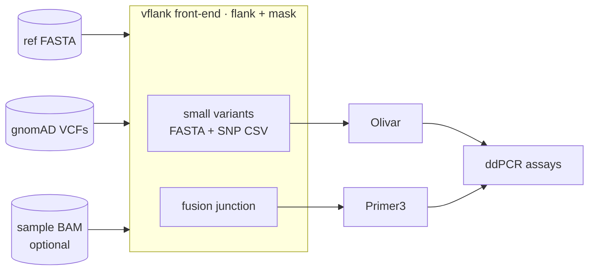
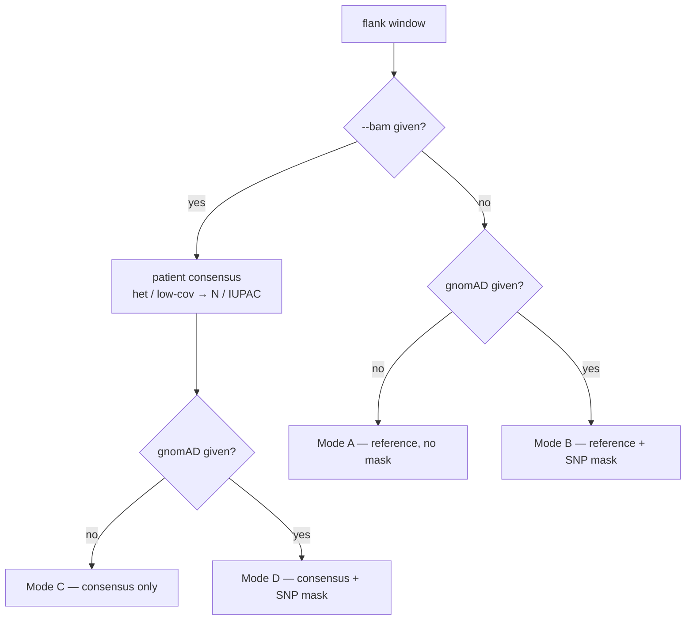
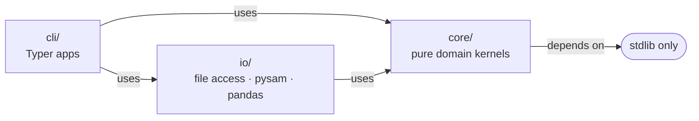

# vflank — Architecture & Roadmap

## What vflank is (and is not)

vflank is the **variant-aware, optionally patient-specific, masked-flank
front-end** of a ddPCR assay-design pipeline. It extracts the sequence flanking
each variant and masks positions that would compromise a primer/probe, then
emits clean targets in designer-native formats.

It is **not** a primer designer. Design is delegated downstream:

| Path | Designer | Why |
|------|----------|-----|
| Small variants (SNP/indel) | **Olivar** (SADDLE, risk-array) | Built for variant-aware multiplex/tiled amplicons. |
| Fusion junction | **Primer3** | Single junction-spanning hybridisation probe. |

Olivar is **GPL-3.0** and pulls in BLAST/MAFFT/NumPy<2, so it is invoked
**out-of-process** (CLI / container), keeping vflank permissively licensed and
the dependency graph clean. Orchestration across samples/tools is a **Nextflow**
layer that wraps the stable CLIs in per-process containers — added last, never a
prerequisite for the standalone CLI.



## Flank source strategy (modes)

A `FlankSource` decides *where each flank base comes from*:

| Mode | Inputs | Source | Masking |
|------|--------|--------|---------|
| A Reference | MAF + FASTA | reference | none |
| B Reference + pop-mask | + gnomAD | reference | common SNPs → N |
| C Consensus | + BAM | patient consensus, ref fallback | het / low-cov → N/IUPAC |
| D Consensus + pop-mask | all | patient consensus | gnomAD ∪ observed-het |

The mode is selected implicitly by which inputs are present:



Mode C/D is the differentiator: patient consensus catches **private/rare**
variants gnomAD never sees — the ones that silently break a primer for one
patient. Consensus is delegated to `samtools consensus` (in-process via
`pysam.samtools`), kept reference-length, with a pure low-coverage overlay and
insertion-site flagging on top. See [research/bam-consensus.md](research/bam-consensus.md).

**All four modes are implemented** (`ReferenceFlankSource` for A/B,
`ConsensusFlankSource` for C/D). The population-mask backend is pluggable behind
a duck-typed `get_positions` interface, with two interchangeable implementations
selected by `--pop-source`: `GnomadStore` (local VCFs) and `GnomadApiSource`
(gnomAD GraphQL API, no download, rate-limited). Both honour
`--pop-data {genome,exome,both}` (union for `both`). See
[research/gnomad-api.md](research/gnomad-api.md).

The **reference source** is likewise pluggable, selected by `--ref-source`:
`ReferenceFasta` (local indexed FASTA, default) and `ReferenceApiSource` (UCSC
getData/sequence API, no download — for hosted/small runs where shipping a FASTA
is impractical). Both expose the `fetch(bare, s0, e0)` window contract
`ReferenceFlankSource` depends on. See [research/genome-api.md](research/genome-api.md).

## Module map

```
src/vflank/
├── core/
│   ├── chrom.py       notation detect/normalise (pure)
│   ├── variant.py     Variant dataclass + validation (pure)
│   ├── flanks.py      FlankSource protocol, ReferenceFlankSource, mask_sequence
│   ├── popfreq.py     gnomAD VCF resolve + parse_common_snp_positions (pure) + GnomadStore
│   ├── popfreq_api.py gnomAD GraphQL API source (GnomadApiSource) + pure parser
│   ├── reference_api.py reference sequence via UCSC API (ReferenceApiSource) + pure parser
│   ├── consensus.py   BAM patient consensus (modes C/D): samtools engine, pure
│   │                  low-cov overlay, insertion-site flagging
│   ├── fusion.py      Breakpoint/Fusion model, reverse-complement junction builder
│   └── skips.py       categorised skip/he reporting helpers (pure)
├── io/
│   ├── maf.py         load/remap/validate (path or buffer), row → Variant
│   ├── reference.py   ReferenceFasta + genome-build guard
│   ├── fasta.py       header sanitise + record format/write
│   ├── breakpoints.py SV/fusion breakpoint-TSV reader (path or buffer)
│   ├── emit_primer3.py Primer3 Boulder-IO writer (EmitRecord -> SEQUENCE_* tags)
│   └── report.py      TSV run-report writer (flexible columns)
├── sources.py        reference/gnomAD source factories from config (validate + build)
├── pipeline.py       use case: iter_small/iter_fusion + collect + run_small/run_fusion
├── cli/
│   ├── app.py         root Typer, global -v/-q/--debug, version
│   ├── small.py       run · inspect · list-vcf (+ masking, BAM, coverage flags)
│   ├── fusion.py      run (+ masking, BAM flags)
│   ├── _bam.py        --bam/--bam-map resolver + ConsensusPolicy builder
│   └── _ui.py         parameter-echo panel
├── logging.py         Rich console + logger
└── errors.py          VflankError hierarchy
```

The hot kernels (`parse_common_snp_positions`, `mask_sequence`, the consensus
overlay) are pure
functions over plain iterables — the natural seam to later accelerate with Rust
(rust-htslib for consensus parity with samtools; noodles for pure-Rust gnomAD
scanning). Lock correctness in Python first; port the proven bottleneck only.

The layering enforces a one-way **dependency rule** — `core/` stays pure so its
kernels remain unit-testable without pysam and portable to Rust:



## Origin

vflank began as two scripts: `get_flanking_sequence.py` (small variants, fully
ported in M2 with the output format preserved) and `design_fusion_primers.py` +
`config_ES_CTDNA_03.cfg` (a legacy Python-2 fusion script that didn't run and
embedded a junction-corrupting `"-"`). Both have been ported / re-implemented and
removed; the conventions recovered from them (the corrected fusion-junction
model, iCallSV strand mapping) are captured in
[research/sv-vcf-input.md](research/sv-vcf-input.md).

## Roadmap

Shipped through **v0.2.0** (on PyPI + GHCR):

| M | Deliverable | State |
|---|-------------|-------|
| M1 | Scaffold (src-layout, pyproject/Hatch, Typer root, logging) | ✅ done |
| M2 | Small-variant port (behaviour-preserving, testable) | ✅ done |
| M3 | Tests + provenance (unit + integration, build guard) | ✅ done |
| M4 | Fusion rewrite (Python 3, breakpoint-TSV input) | ✅ done |
| M4.5 | BAM consensus (modes C/D) + insertion flagging | ✅ done (0.2.0) |
| M5 | MkDocs (Material + mkdocstrings, versioned via mike) | ✅ done |
| M6 | Release (PyPI via OIDC; GHCR image) | ✅ done (0.1.0, 0.2.0) |

Next, in priority order (each has a design note in `research/`):

| Next | Deliverable | Design note |
|------|-------------|-------------|
| **M4.5-emit** | `--emit olivar,primer3` designer-native output formats | [emit-formats.md](research/emit-formats.md) |
| M-vcf | VCF input — small-variant VCF, then Delly `CT`/`BND` SV VCF | [sv-vcf-input.md](research/sv-vcf-input.md) |
| M-indel | Indel-aware (length-changing) consensus — option 3 | [indel-aware-consensus.md](research/indel-aware-consensus.md) |
| M7 | Nextflow / nf-core pipeline (containerised) | — |
| M-rust | Port the proven hot kernels to Rust (optional) | — |

### Top risks
1. Reference build mismatch → silent wrong sequence — guarded in `reference.py`.
2. pysam wheel fragility — CI matrix Linux+macOS; document WSL/conda.
3. Indel coordinate edge cases — insertion flagging shipped; length-changing
   consensus is deferred to M-indel with its own test matrix.
4. Olivar input-schema drift — pin a version and assert columns in the emitter
   (M4.5-emit); the dependency itself stays out-of-process (GPL isolation).
