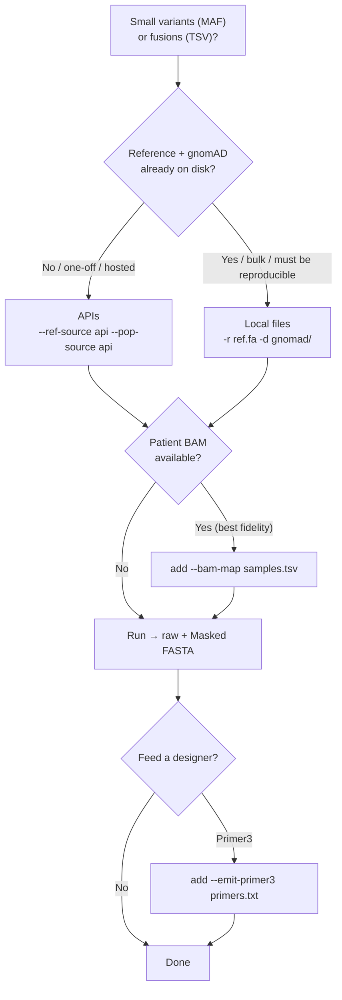

# Recommended Usage

`vflank` exposes many flags, but a real run comes down to a **few decisions**.
Good defaults cover the rest (`--genome-build hg19`, `--flank 200`,
`--pop-data genome`, `--af-threshold 0.001`). This page gives the recommended
command for each situation; reach for the [CLI reference](../reference/cli.md)
only when you need an override.

## Which mode should I use?



The first split is the one that matters most — **where the data comes from** —
and there is no single right answer; it depends on your situation.

## The two recommended setups

=== ":material-flash: Quick / hosted / small cohort"

    No local data, small inputs, or a hosted/one-off check. Fetch the reference
    and gnomAD over the network — **nothing to download**:

    ```bash
    vflank small run variants.maf -g hg19 \
        --ref-source api --pop-source api
    ```

    **Use when:** a handful of variants, an ad-hoc check, a CI/demo, or a hosted
    service with no reference on disk.

    - :material-check: Zero setup; both builds supported.
    - :material-alert: Rate-limited (~1 req/s reference, ~10/min gnomAD) → small
      inputs only. Needs network, and the served data can change over time
      (**not** reproducible) — record the run for provenance.

=== ":material-database: Reproducible / bulk / offline"

    Real cohort work, an HPC node, or anything that must be auditable and
    repeatable. Use a **local indexed FASTA + local gnomAD VCFs**:

    ```bash
    vflank small run variants.maf \
        --ref-genome GRCh37.fasta \
        --pop-vcf-dir gnomad_v2.1.1/ \
        --genome-build hg19
    ```

    **Use when:** more than a few dozen variants, a pipeline, or results you must
    reproduce later.

    - :material-check: Offline, unlimited scale, reproducible (pin the data
      version); the build is sanity-checked against the FASTA's chr1 length.
    - :material-alert: Requires the FASTA (`.fai` alongside) and per-chromosome
      gnomAD VCFs on disk — see [Installation](installation.md) and
      [SNP Masking](../user-guide/masking.md) for download commands.

!!! tip "Mix and match"
    The two backends are independent: `--ref-source` and `--pop-source` can each
    be `file` or `api`. A common middle ground is a **local FASTA** with the
    **gnomAD API** for masking (`-r ref.fa --pop-source api`), or vice versa.

## Add patient consensus (best assay fidelity)

When you have the patient's reads, build the flank from them so primers match the
real template (catches private/rare variants gnomAD never saw). Add one flag to
either setup above:

```bash
vflank small run variants.maf -r GRCh37.fasta -d gnomad_v2.1.1/ -g hg19 \
    --bam-map samples.tsv          # sample<TAB>bam_path
```

Output becomes one record per (variant, sample). See [BAM Consensus](../user-guide/consensus.md).

## Fusions

Identical decisions, different input (a breakpoint TSV):

```bash
vflank fusion run breakpoints.tsv -r GRCh37.fasta -g hg19 \
    --pop-source api               # optional: mask the junction flanks
```

## Hand off to a designer

Add `--emit-primer3 primers.txt` to either command to also write a Primer3
Boulder-IO file alongside the FASTA — ready for probe/primer design. See
[Small Variants → Emit for Primer3](../user-guide/small-variants.md#emit-for-primer3).

## The flags worth knowing

Everything else is an override with a sensible default. These are the ones you
might actually change:

| Flag | Default | Change it when |
|------|---------|----------------|
| `--genome-build` / `-g` | `hg19` | your data is GRCh38 → `hg38` |
| `--flank` / `-f` | `200` | you need longer/shorter design windows |
| `--pop-data` | `genome` | masking near exons → `both` (genome ∪ exome) |
| `--af-threshold` | `0.001` | you want stricter/looser SNP masking |
| `--report` | off | you want a per-variant TSV + skip breakdown |

The remaining flags (MAF column remapping, BAM-consensus tuning, sample
filtering) are grouped into panels in `vflank small run --help` — you rarely need
them.
