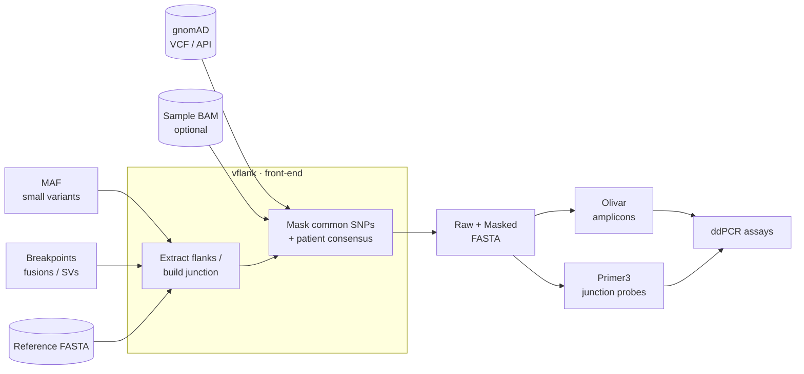

# vflank

**Variant-aware flanking-sequence extraction and masking for ddPCR assay design.**

`vflank` takes genomic variants — small variants (SNPs/indels) and structural
variants (fusions) — and produces the sequence a ddPCR assay is designed around:
the flanks of each variant (or the chimeric junction of a fusion), with common
polymorphisms masked so primers and probes avoid them.

It is the **front-end** of an assay-design pipeline. It does not design primers
itself — it prepares clean, masked target sequences to hand to a designer.



## Highlights

- :material-dna: **Small variants** — extract ±N bp flanks from a MAF, emit raw +
  masked FASTA records, deduplicated per unique variant (`CHR_POS_REF_ALT`).
- :material-call-split: **Fusions / SVs** — build the reverse-complement-aware
  junction sequence from a breakpoint table (iCallSV / iAnnotateSV format).
- :material-filter: **SNP masking, two ways** — local gnomAD VCFs *or* the gnomAD
  GraphQL API (no download), each with `genome` / `exome` / `both`.
- :material-shield-check: **No silent failures** — build-mismatch guard, flank
  truncation detection, and a categorised skip summary.

## Install

```bash
pip install vflank                                    # released versions, from PyPI
pip install git+https://github.com/rhshah/vFlank.git  # latest from GitHub
```

See [Installation](getting-started/installation.md) and the
[Quick Start](getting-started/quickstart.md).

## At a glance

```bash
# Small variants: flanks + masking via the gnomAD API (no download)
vflank small run variants.maf -r GRCh37.fasta -g hg19 --pop-source api

# Fusions: junction sequences from a breakpoint table
vflank fusion run breakpoints.tsv -r GRCh37.fasta -g hg19
```

## Scope

vflank stops at the prepared target sequence. Downstream, those sequences feed a
primer/probe designer (e.g. Primer3 for fusion-junction probes). See the
[Architecture](ARCHITECTURE.md) for the full picture and roadmap.
