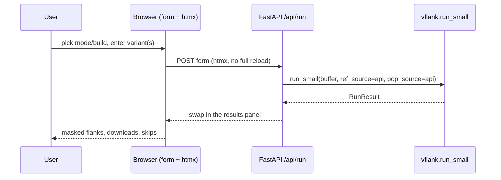

# vFlank-webapp — UI/UX & backend design

Status: **proposed** (2026-06-15). The detailed design for the
[separate `vFlank-webapp` repo](webapp-repo-structure.md), now that the library
prerequisites shipped in **0.5.0** (`vflank.pipeline.run_small`/`run_fusion`,
buffer input). Scope is **v1** per [web-app-and-hosting.md](web-app-and-hosting.md):
single-variant / tiny-batch, modes A/B (reference + gnomAD, **no BAM, no PHI**),
UCSC + gnomAD APIs, FastAPI on Render. BAM/WASM is v2.

## What the library now gives the webapp

The webapp is thin because 0.5.0 did the work: one call does everything.

```python
from vflank.pipeline import run_small      # or run_fusion
result = run_small(
    uploaded_buffer, genome_build="hg19",
    ref_source="api", pop_source="api",     # no local files
    flank=200, emit_primer3=want_primer3,
)
# result: records, rows, skip_messages, skip_breakdown, n_processed/n_skipped,
#         ref_api_requests, api_requests
```

The webapp adds only: HTTP, a form, a record cap, error→status mapping, and
rendering. **All input validation is inherited** (bad build/options →
`VflankError`; bad rows → per-row skips).

## Backend

### Stack
FastAPI + uvicorn; Jinja2 for the one server-rendered page; Pydantic for the
request/response models; **no database**. `pip install "vflank>=0.5"`. Stateless
→ matches Render's ephemeral filesystem.

### Endpoints

| Method · path | Purpose |
|---|---|
| `GET /` | the single-page form (server-rendered) |
| `POST /api/run` | run the pipeline → JSON `{records, rows, skips, stats}` |
| `GET /api/run.fasta` *(or `?format=fasta`)* | same, returned as a FASTA download |
| `GET /healthz` | liveness (for keep-warm pings) |

### Request / response (Pydantic)

```python
class RunRequest(BaseModel):
    mode: Literal["small", "fusion"]
    genome_build: Literal["hg19", "hg38"]
    text: str                       # pasted table OR assembled from the structured form
    flank: int = Field(200, ge=10, le=400)
    af_threshold: float = Field(0.001, ge=0, le=1)
    pop_data: Literal["genome", "exome", "both"] = "genome"
    emit_primer3: bool = False
    dedup: bool = True

class RunResponse(BaseModel):
    records: list[str]              # FASTA records (raw + masked)
    rows: list[dict]                # per-variant detail
    skips: dict[str, int]           # categorised skip breakdown
    skip_examples: list[str]
    stats: dict                     # processed/skipped, api requests, elapsed
    primer3: str | None             # Boulder-IO text if requested
```

The handler writes `text` to an in-memory `io.StringIO` and calls
`run_small`/`run_fusion(buf, ref_source="api", pop_source="api", …)`.

### Policy the service owns (not the library)
- **≤ 10-record cap** *after* parse → `422` with "the hosted tool accepts ≤10
  records; use the CLI/PyPI package for bulk." Protects the shared instance and
  the gnomAD rate limit. Deliberately **not** a cap in `run_small` (it would
  regress local batch users).
- **Max upload / body size** (e.g. 256 KB) at the ASGI layer.
- **Error mapping:** `VflankError`/`MafError`/`SvError` → `400`/`422` with the
  message; per-row skips are **data**, returned in the body, never 500s.

### Concurrency, rate-limit, cache — the one real subtlety
`run_small` is synchronous (urllib + pandas), so run it in a threadpool
(`await run_in_threadpool(run_small, …)`) to keep the event loop free.

**The catch:** `run_small` builds a *fresh* `ReferenceApiSource` per call, so its
~1 req/s UCSC throttle is **per-request, not global**. Under concurrency, N
requests can each hit UCSC at 1/s → N req/s total, which UCSC may block (it has
blocked apps before). Options, cheapest first:

1. **v1, low traffic:** accept it; add a small per-process **response cache**
   (LRU keyed on `(mode, build, sha256(text), params)`) so repeats are free, and
   a per-IP request limiter (`slowapi`). Good enough for a demo/internal tool.
2. **Shared source / global limiter:** have the app hold one long-lived
   `ReferenceApiSource` (one throttle + one window cache for everyone) and drive
   the pipeline via the streaming primitives `iter_small`/`collect` with that
   injected source — instead of `run_small` building its own. This is the clean
   answer and motivates a tiny future library change: **let `run_small`/
   `run_fusion` accept optional pre-built `reference=`/`gnomad=` sources** (inject
   over build). Recommended once traffic is non-trivial.

Recommendation: ship v1 with option 1 + a response cache; add the
inject-sources enhancement to vflank when option 2 is needed (it's a small,
non-breaking addition with a real caller — not speculative then).

### Deployment (Render free tier)
`render.yaml`: a web service, `pip install -e .`, `uvicorn app:app --host 0.0.0.0
--port $PORT`. Plan for the free-tier traits already noted in the hosting note:
cold-start after idle (acceptable; optional keep-warm cron hitting `/healthz`),
single instance (the natural home for the cache + limiter), latency dominated by
the external APIs.

### Security
No auth (public, no PHI). HTTPS via Render. Same-origin server-rendered page →
**no CORS** needed. Strict input size + record caps. No secrets (the APIs are
unauthenticated). Add `slowapi` per-IP limiting to be polite to UCSC/gnomAD.

## Frontend — UI/UX

### One page, three moments: **describe → run → read the result**



### Layout (top to bottom)
1. **Header** — name + one-line "Mask variant flanks for ddPCR assay design — no
   install, no upload of patient data." Slate+amber "Highlighter" palette, reused
   from the docs for brand continuity.
2. **Mode** — a segmented toggle: **Small variant** ↔ **Fusion**.
3. **Build** — GRCh37/hg19 ↔ GRCh38/hg38.
4. **Input** — two tabs:
   - **Structured (default, the nice single-variant UX):** for *small*, four
     fields `chr · pos · ref · alt` (+ optional gene); for *fusion*, two
     breakpoints `chr:pos:strand`. A **"＋ add row"** lets you enter a handful.
     The browser assembles a minimal MAF/breakpoint-TSV string and posts it —
     **so v1 gets the structured form with no library change** (no `make_variant`
     needed; the table is built client-side). A **"Load example"** button fills
     a known variant (e.g. BRAF V600E).
   - **Paste / upload:** a textarea (paste a small MAF/TSV) or file picker, for
     people who already have a file.
5. **Advanced (collapsed):** flank size (slider 10–400, default 200), AF
   threshold, pop-data (genome/exome/both), "also emit Primer3", dedup.
6. **Run** button → loading state ("Querying reference + gnomAD…", a spinner;
   latency is the external APIs).
7. **Results panel** (swapped in via htmx):
   - Per variant: the masked flank rendered **monospace**, the variant shown as
     `[REF/ALT]` and **masked `N`s highlighted in amber** — the same "Reading a
     record" treatment as the docs. A **Raw ↔ Masked** toggle (the `--records`
     idea).
   - **Downloads:** FASTA, Primer3 (if emitted), TSV report.
   - **Skips** surfaced inline as a friendly list ("2 rows skipped — non-numeric
     position"), never as an error.
   - A quiet stats line: processed / skipped · reference+gnomAD API calls · time.

### Principles
- **Progressive enhancement.** The `GET /` form works without JS (full POST →
  rendered results). **htmx** enhances it: POST the form, swap only the results
  panel — no SPA build step, tiny payload, matches the "no JS toolchain for v1"
  decision.
- **No patient-data framing.** Copy makes clear only public reference + gnomAD
  data flow through the tool (v1 has no BAM); reinforces trust.
- **Accessibility.** Keyboard-navigable, ARIA labels, never color-only (masked
  regions get a mark **and** an underline); respects reduced-motion.
- **Responsive.** The form is small; works on a phone.

## Starter repo layout (vFlank-webapp)

```
vFlank-webapp/
├── app/
│   ├── main.py            FastAPI app: GET / , POST /api/run , /healthz
│   ├── models.py          RunRequest / RunResponse (Pydantic)
│   ├── service.py         thin wrapper over vflank.run_small/run_fusion + the cap/cache
│   ├── templates/         index.html (Jinja2) + the results partial (htmx swap)
│   └── static/            style.css (slate+amber), a little htmx + vanilla JS
├── tests/                 endpoint tests (TestClient): happy path, cap, bad input, skips
├── pyproject.toml         deps: fastapi, uvicorn, jinja2, vflank>=0.5  (+ slowapi)
├── render.yaml            Render web service
├── Dockerfile             optional (parity with GHCR pattern)
└── README.md              this design, condensed
```

## Phasing
- **v1** — the above: structured/paste input, modes A/B, API sources, downloads.
- **v1.1** — if a richer single-variant form is wanted server-side, add
  `vflank.core.make_variant`/`make_fusion` (the deferred builders) so structured
  input can skip the client-side table assembly; add the **inject-sources**
  option to `run_small` for a shared throttle/cache under load.
- **v2** — BAM via client-side WASM (biowasm/Aioli) + a JS port of the pure
  overlay; PHI stays in the browser. Likely a static/hybrid front-end then.

## Open questions
- Keep-warm vs. accept cold starts on the free tier (start by accepting).
- Per-IP limit thresholds (be conservative toward UCSC/gnomAD).
- Whether to show a small sequence-logo / position ruler in the result (nice,
  not v1).
